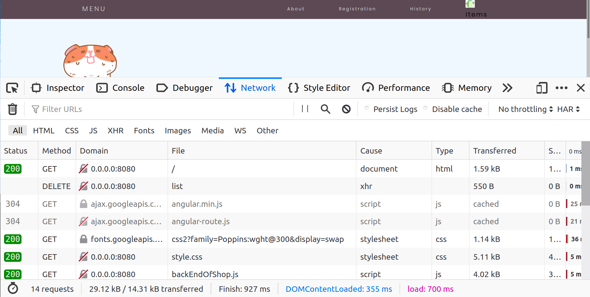

# HamsterShop
Project for University so far most advance project I did. I used html,css,Angular Js, and Java. Made several httpp request then loading page to take some data from java and put in html via Angular Js, some request was made to control data in webpage like adding deleting products also this page have repsonsive design which is pretty cool. I learned about angular Js and  MVC software design pattern. Also learn about HTTP requests. 

If you want to run this webservice you need to download maven or GralVM all info in https://quarkus.io/get-started/

Short steps how to run this program

IF YOU NOT SURE IF YOU HAVE JAVA TYPE JAVA -version or JAVA --version if you not have follow this steps
1. Install JAVA 11 or newer
2. Check if you set java as JAVA_HOME if not set it
3. Add JAVA_HOME to PATH

Install Maven, download this folder then go to this folder via cmd and run ./mvnw compile quarkus:dev on linux or 
mvnw compile quarkus:dev on windows if you have question you can write a message to my email realfanas@gmail.com

<h1> How it looks </h1>

<h1> HTTP REQUESTS </h1>

<h1> Responsive Design </h1>

<h1> List of products </h1>

